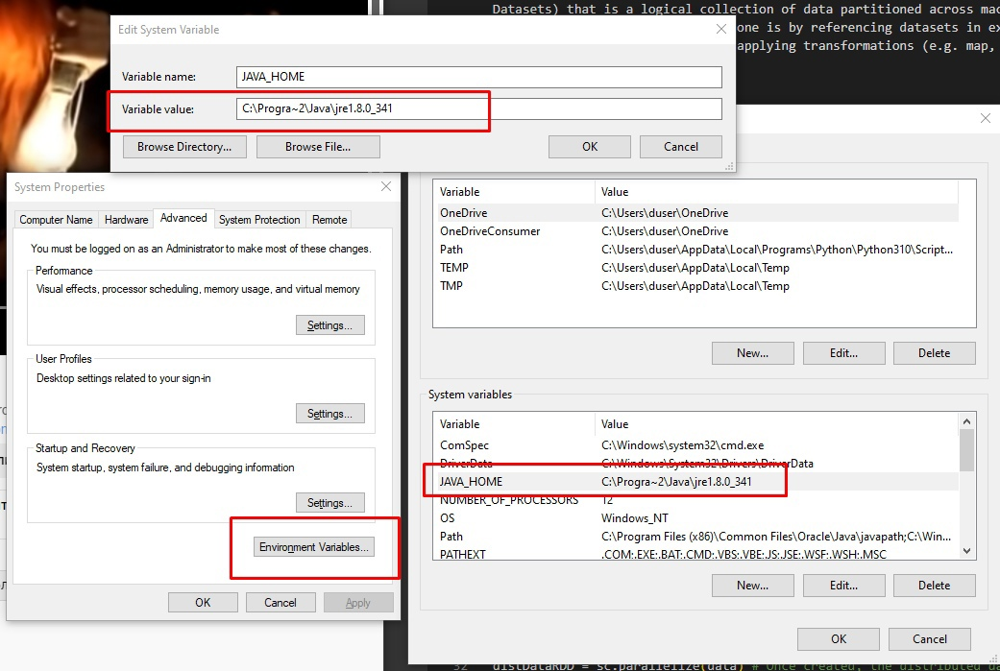
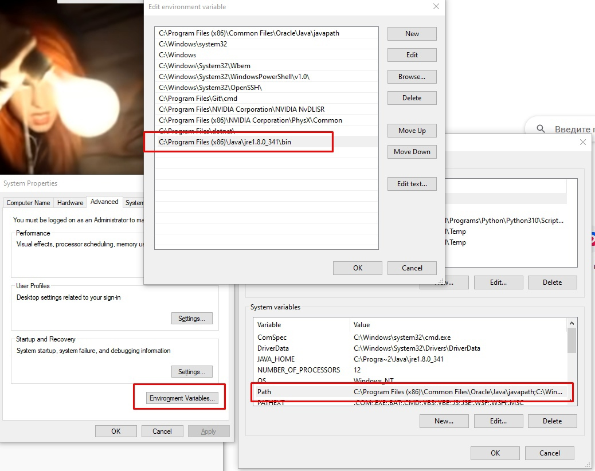
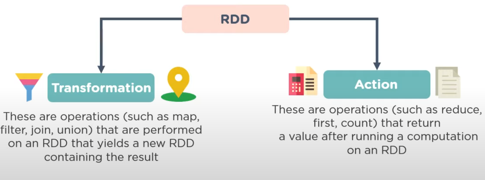
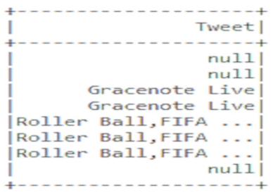
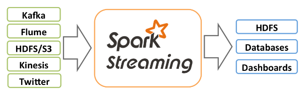
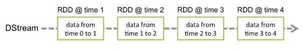
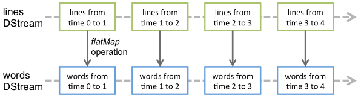
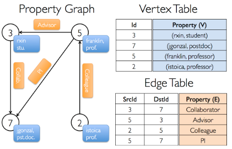
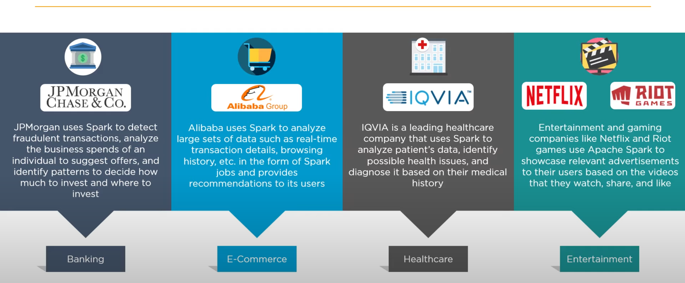

# Введение в Apache Spark
## Что такое Spark?

**Apache Spark** (от англ. *spark* — искра, вспышка) – это фреймворк с открытым исходным кодом для реализации распределенной обработки неструктурированных и слабоструктурированных данных, входящий в экосистему проектов Hadoop. *Apache Spark* использует кэширование в памяти и оптимизированное выполнение для высокого быстродействия, а также поддерживает общую пакетную обработку, аналитику потоков, машинное обучение, графовые базы данных и спонтанные запросы. 

*Spark* обрабатывает большие объемы данных в памяти, что намного быстрее, чем альтернативная обработка с использованием диска. Также *Spark* дает возможность многократного доступа к загруженным в память пользовательским данным делает библиотеку привлекательной для алгоритмов машинного обучения.


Например, если нужно обработать данные о годовых продажах одного магазина, то программисту хватит одного компьютера и кода на Python, чтобы произвести расчет. Но если обрабатываются данные от тысяч магазинов из нескольких стран, причем они поступают в реальном времени, содержат пропуски, повторы, ошибки, тогда стоит использовать мощности нескольких компьютеров и *Spark*. Группа компьютеров, одновременно обрабатывающая данные, называется кластером, поэтому *Spark* также называют фреймворком для кластерных вычислений.

## История Spark
Ключевой автор *Apache Spark* — румынско-канадский ученый в области информатики **Матей Захария** (англ. *Matei Zaharia*), начал работу над проектом в 2009 году, будучи аспирантом Университета Калифорнии в Беркли. В 2010 году проект опубликован под лицензией BSD, в 2013 году передан фонду Apache и переведен на лицензию Apache 2.0, в 2014 году принят в число проектов верхнего уровня Apache. В 2022 году проект получил ежегодную премию SIGMOD в номинации «Системы».


## Hadoop vs Spark

Одна из особенностей самых выдающихся технических профессий — это открытая атмосфера, которая поощряет исследования и разработки. Тот же подход хорошо работает при сравнении таких продуктов, как Hadoop и Spark. Любой вариант предлагает качественную структуру с надёжными функциями. Итак, что же такое Spark и Hadoop? Какие варианты и подходы есть у этих двух компаний и есть ли области, в которых они предлагают идентичные услуги?

**Ключевой концепцией**, которую следует понимать при работе со Spark и Hadoop, является понятие больших данных. **Большие данные** — это сбор и изучение огромных объёмов информации с целью лучшего понимания рынка, клиентов и потребностей. Однако большие данные производят огромное количество информации. И для её обработки необходимо использовать **специальные методы распространения и анализа**. И Hadoop, и Spark делают это через распределённые среды компьютеров и приложений.

**Spark** — инфраструктура кластерных вычислений, сходная с Hadoop MapReduce. Однако Spark не занимается ни хранением файлов в файловой системе, ни управлением ресурсами. Spark обрабатывает данные **ещё быстрее с помощью встроенных коллекций RDD** (Resilient Distributed Datasets), которые дают возможность выполнять вычисления в больших кластерах. Благодаря RDD можно совершать такие операции, как *map, join, reduce*, записывать данные на диск и загружать их.

Рассмотрим таблицу сравнения Hadoop и Spark:

|Hadoop                |         Spark      |
|----------------------|--------------------|
|Обработка данных с использованием MapReduce  происходит медленнее| Обрабатывает данные в 100 раз быстрее|
|Выполняет пакетную обработку данных| Выполняет как пакетную обработку, так и обработку данных в реальном времени|
|Написан на Java, больше строк кода| В Spark меньше строк кода, так как он реализован на Scala|
---

Промежуточные данные вычислений не записываются на диск, а образуют своего рода **общую оперативную память**. Это позволяет разным рабочим процессам использовать общие переменные и их состояния.

### Отложенные вычисления

Spark приступает к выполнению запроса лишь при непосредственном обращении к нему (вывод на экран, запись конечных данных на диск). В этом случае срабатывает планировщик, соединяя все преобразования, написанные ранее.

Spark и Hadoop относятся к разным эпохам компьютерного дизайна и разработки. И это проявляется в том, как они обрабатывают данные. Hadoop должен управлять своими данными **в пакетном режиме** благодаря своей версии MapReduce. А это означает, что у него нет возможности **работать с данными в реальном времени по мере их поступления**. Это одновременно и преимущество, и недостаток — **пакетная обработка** — это эффективный метод работы с большими объёмами данных, но отсутствие метода обработки потоковых данных снижает производительность Hadoop.

Другое различие между Hadoop и Spark заключается в том, что Spark предоставляет **множество API**, которые можно использовать с несколькими источниками данных и языками. Кроме того, они более расширяемы, чем Hadoop API.

В заключение следует отметить, что различие между Hadoop и Spark заключается в том, что **Hadoop - это платформа Apache с открытым исходным кодом, которая позволяет распределенную обработку больших наборов данных по кластерам компьютеров с использованием простых моделей программирования**, тогда как **Spark - это среда кластерных вычислений, предназначенная для быстрых вычислений Hadoop**. Оба могут быть использованы для приложений, основанных на прогнозирующей аналитике, интеллектуальном анализе данных, машинном обучении и многом другом.

---

## Pyspark установка
1. Установи Python >= 3.7 
2. Установи pyspark using pip: ````pip install pyspark````
3. Установи Java
4. Установи переменные среды для Java как на картинках ниже


<br><br><br><br><br>

## Spark компоненты
## Core
>Spark Core является основой всего проекта. Он обеспечивает распределенное выполнение задач, планирование и основные функции ввода-вывода. Spark использует специализированную фундаментальную структуру данных, известную как RDD (Resilient Distributed Datasets), которая представляет собой логическую коллекцию данных, разделенных между машинами. RDD могут быть созданы двумя способами: первый - путем ссылки на наборы данных во внешних системах хранения и второй - путем применения actions (например, map, filter, reducer, join) к существующим RDD.
Нужен для:
* Управления памятью
* Восстановления после сбоев
* Планирования, распределения и мониторинга заданий в кластере
* Взаимодействия с системой хранения

## RDD (Resilient Distributed Dataset)
> В Spark Core встроены RDD, неизменяемые отказоустойчивые, распределенные коллекции объектов, с которыми можно работать параллельно.
> <br>Работая с RDD, необходимо знать две основные вещи: : transformations и actions.
* RDD transformations возвращают указатель на новый RDD и позволяют создавать зависимости между RDD. Каждый RDD в цепочке зависимостей (String of Dependencies) имеет функцию для вычисления своих данных и имеет указатель (зависимость) на свой родительский RDD. Spark ленив, поэтому ничего не будет выполняться, пока вы не вызовете какое-либо преобразование или действие, которое вызовет создание и выполнение задания. Посмотрите на следующий фрагмент примера подсчета слов. Таким образом, преобразование RDD - это не набор данных, а шаг в программе, указывающий Spark, как получить данные и что с ними делать.
* RDD actions это операции (reduce, count...), которые возвращают значение в соответствии с инструкцией. 

## Пример (Создание RDD)
``` python
from pyspark import SparkContext, SparkConf
conf = SparkConf().setAppName(appName).setMaster(master)
sc = SparkContext(conf=conf)
# Parallelized collection
data = [1, 2, 3, 4, 5]
distDataRDD = sc.parallelize(data) # После создания распределенного набора данных (distDataRDD) с ним можно работать параллельно.
print(distDataRDD.reduce(lambda a, b: a + b))
# Внешний набор данных
distFileRDD = sc.textFile("data.txt")
distFileRDD2 = distFileRDD.map(lambda s: len(s))
print(distFileRDD2.reduce(lambda a, b: a + b))
```
## Spark SQL
> Spark SQL - это модуль Spark для обработки структурированных данных. Spark SQL позволяет запрашивать структурированные данные внутри программ Spark, используя либо SQL, либо привычный API DataFrame. Используется в Java, Scala, Python и R.
## Возможности
* Чтение и запись данных в различных структурированных форматах (например, JSON, таблицы Hive, Parquet, Avro, ORC, CSV).
* Позволяет запрашивать данные с помощью коннекторов JDBC/ODBC из внешних источников данных бизнес-аналитики (BI), таких как Tableau, Power BI, Talend, или из РСУБД, таких как MySQL и PostgreSQL.
* Предоставляет программный интерфейс для взаимодействия со структурированными данными, хранящимися в виде таблиц или представлений в базе данных, из приложения Spark.
* Предлагает интерактивную оболочку для выполнения SQL-запросов к структурированным данным.
## Примеры
### Базовая конфигурация
``` python
from pyspark.sql import SparkSession
# SparkSession - это точка входа для работы со Spark
spark = SparkSession \
    .builder \
    .appName("Python Spark SQL basic example") \
    .config("spark.some.config.option", "some-value") \
    .getOrCreate()
# Creating view from an existing data collection
my_table = csv_data.createOrReplaceTempView('my_table')
```
### Обработка данных 
``` python
# Обработаем набор данных, содержащий информацию о твитах, id которых находится в диапазоне от 1 до 10:
csv_data = spark.read.option('header','True').csv('my_tweets.csv',sep=',')
my_table = csv_data.createOrReplaceTempView('tweets_table')
sql_table = spark.sql('SELECT  Tweet FROM tweets_table WHERE id IN (1,10)')sql_table.show()
```


## Spark Streaming
## Обзор
> Spark Streaming - это расширение основного API Spark, которое позволяет выполнять масштабируемую, высокопроизводительную и отказоустойчивую обработку потоков данных в реальном времени. Данные могут поступать из различных источников, таких как Kafka, Kinesis или TCP-сокеты, и могут обрабатываться с помощью сложных алгоритмов, выраженных с помощью высокоуровневых функций, таких как map, reduce, join и window. Наконец, обработанные данные могут быть переданы в файловые системы, базы данных и живые приборные панели. Фактически, вы можете применять алгоритмы машинного обучения и обработки графов Spark к потокам данных.


## Discretized Streams (DStreams)
> Discretized Streams или DStream - это базовая абстракция, предоставляемая Spark Streaming. Он представляет собой непрерывный поток данных, либо входной поток данных, полученный из источника, либо обработанный поток данных, созданный путем преобразования входного потока. Внутри DStream представлен непрерывной серией RDD, которая является абстракцией Spark для неизменяемого, распределенного набора данных (подробнее см. руководство по программированию Spark). Каждый RDD в DStream содержит данные за определенный интервал времени, как показано на следующем рисунке.


> Любая операция, применяемая к потоку DStream, переводится в операции над лежащими в его основе RDD. Например, в предыдущем примере преобразования потока строк в слова операция flatMap применяется к каждому RDD в потоке строк DStream для создания RDD потока слов DStream. Это показано на следующем рисунке.  


## Пример
``` python
from pyspark import SparkContext
from pyspark.streaming import StreamingContext
# Создайте локальный StreamingContext с двумя рабочими потоками и интервалом пакетной обработки 1 секунда
sc = SparkContext("local[2]", "NetworkWordCount")
ssc = StreamingContext(sc, 1)
# Создайте DStream, который будет подключаться к имени хоста:порту, например, localhost:9999
lines = ssc.socketTextStream("localhost", 9999)
# Разделите каждую строку на слова
words = lines.flatMap(lambda line: line.split(" "))
# Подсчитайте каждое слово в каждой партии
pairs = words.map(lambda word: (word, 1))
wordCounts = pairs.reduceByKey(lambda x, y: x + y)
# Выведите на консоль первые десять элементов каждого RDD, сгенерированного в этом DStream
wordCounts.pprint()
ssc.start()             # Начать вычисления
ssc.awaitTermination()  # Ожидание окончания вычислений
```
## Spark MLlib
> Spark MLlib - это библиотека фреймворка Apache Spark, которая позволяет реализовать механизм машинного обучения (ML) и решать задачи, связанные с построением и обучением ML-моделей (например, модель классификации, модель регрессии, модель кластеризации). Spark MLlib позволяет работать с машинным обучением в распределенном кластере, то есть обучение модели может выполняться несколькими узлами (компьютерами) одновременно. При этом в качестве обучающих данных он принимает распределенные наборы RDD (Resilient Distributed Dataset).
## Алгоритмы
* Classification: logistic regression, naive Bayes,...
* Regression: generalized linear regression, survival regression,...
* Decision trees, random forests, and gradient-boosted trees
* Recommendation: alternating least squares (ALS)
* Clustering: K-means, Gaussian mixtures (GMMs),...
* Topic modeling: latent Dirichlet allocation (LDA)
* Frequent itemsets, association rules, and sequential pattern mining
## Spark GraphX
## Обзор
> GraphX - это новый компонент Spark для графов и графо-параллельных вычислений. На высоком уровне GraphX расширяет Spark RDD, представляя новую абстракцию графа: направленный мультиграф со свойствами, привязанными к каждой вершине и ребру. GraphX включает набор графовых алгоритмов для упрощения аналитических задач.
## Property graph
> Property graph представляет собой направленный мультиграф с определенными пользователем объектами, прикрепленными к каждой вершине и ребру. Как и RDD, графы свойств являются неизменяемыми, распределенными и отказоустойчивыми. Изменения значений или структуры графа выполняются путем создания нового графа с желаемыми изменениями. Как и в случае с RDD, каждый раздел графа может быть воссоздан на другой машине в случае сбоя.
## Операции над графами
> Подобно тому, как RDD имеют базовые операции, такие как map, filter и reduceByKey, графы свойств также имеют набор базовых операторов, которые принимают определенные пользователем функции и создают новые графы с преобразованными свойствами и структурой.
## Пример (Creating property graph)
``` scala
// Assume the SparkContext has already been constructed
val sc: SparkContext
// Create an RDD for the vertices
val users: RDD[(VertexId, (String, String))] =
  sc.parallelize(Seq((3L, ("rxin", "student")), (7L, ("jgonzal", "postdoc")),
                       (5L, ("franklin", "prof")), (2L, ("istoica", "prof"))))
// Create an RDD for edges
val relationships: RDD[Edge[String]] =
  sc.parallelize(Seq(Edge(3L, 7L, "collab"),    Edge(5L, 3L, "advisor"),
                       Edge(2L, 5L, "colleague"), Edge(5L, 7L, "pi")))
// Define a default user in case there are relationship with missing user
val defaultUser = ("John Doe", "Missing")
// Build the initial Graph
val graph = Graph(users, relationships, defaultUser)
```


## Приложения с использованием Spark в мире 

## Приложения с использованием Spark в России
> В России так же нужны Spark специалисты, например в Сбербанке, ниже некоторые ссылки с примерами вакансий на hh.ru
* https://nn.hh.ru/vacancy/70584413?from=vacancy_search_list&hhtmFrom=vacancy_search_list&query=Spark
* https://nn.hh.ru/vacancy/70032099?from=vacancy_search_list&hhtmFrom=vacancy_search_list&query=Spark%20apache
* https://nn.hh.ru/vacancy/69816108?from=vacancy_search_list&hhtmFrom=vacancy_search_list&query=SPark

# Источники
 - [Hadoop vs Spark: habr.com](https://habr.com/ru/company/luxoft/blog/569330/)
 - [Hadoop vs Spark: What's the Difference?](https://www.ibm.com/cloud/blog/hadoop-vs-spark)
 - [Hadoop vs Spark: detailed comparison](https://bestprogrammer.ru/programmirovanie-i-razrabotka/spark-ili-hadoop-podrobnoe-sravnenie)
 - [https://ru.wikipedia.org/wiki/Apache_Spark](https://ru.wikipedia.org/wiki/Apache_Spark)
 - [https://learn.microsoft.com/ru-ru/dotnet/spark/what-is-spark](https://learn.microsoft.com/ru-ru/dotnet/spark/what-is-spark)
 - [https://blog.skillfactory.ru/glossary/spark/](https://blog.skillfactory.ru/glossary/spark/)
 - [https://aws.amazon.com/ru/elasticmapreduce/details/spark/](https://aws.amazon.com/ru/elasticmapreduce/details/spark/)