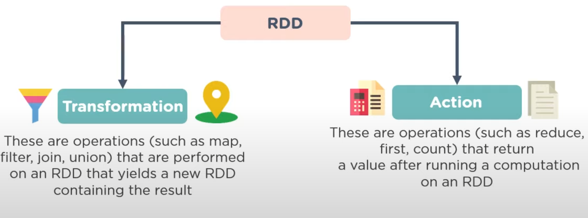
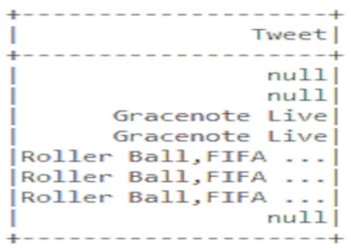

# Core
>Spark Core is the base of the whole project. It provides distributed task dispatching, scheduling, and basic I/O functionalities. Spark uses a specialized fundamental data structure known as RDD (Resilient Distributed Datasets) that is a logical collection of data partitioned across machines. RDDs can be created in two ways; one is by referencing datasets in external storage systems and second is by applying transformations (e.g. map, filter, reducer, join) on existing RDDs.

## Responsible for
* Memory managment
* Fault recovery
* Scheduling, distributing and monitoring jobs on a cluster
* Interacting with storage system

## RDD (Resilient Distributed Dataset)
> Spark Core is embedded with RDDs, an immutable fault-tolerant, destributed collection of objects that can be operated on in parallel.
> <br>Working with RDD you need to know 2 main things: transformations and actions.
* RDD transformations returns pointer to new RDD and allows you to create dependencies between RDDs. Each RDD in dependency chain (String of Dependencies) has a function for calculating its data and has a pointer (dependency) to its parent RDD. Spark is lazy, so nothing will be executed unless you call some transformation or action that will trigger job creation and execution. Look at the following snippet of the word-count example. Therefore, RDD transformation is not a set of data but is a step in a program telling Spark how to get data and what to do with it.
* RDD actions are operations(reduce, count...) that return the value according to its instruction 

## Example (Creating RDD)
``` python
from pyspark import SparkContext, SparkConf

conf = SparkConf().setAppName(appName).setMaster(master)
sc = SparkContext(conf=conf)

# Parallelized collection
data = [1, 2, 3, 4, 5]
distDataRDD = sc.parallelize(data) # Once created, the distributed dataset (distDataRDD) can be operated on in parallel.
print(distDataRDD.reduce(lambda a, b: a + b))

# External dataset
distFileRDD = sc.textFile("data.txt")
distFileRDD2 = distFileRDD.map(lambda s: len(s))
print(distFileRDD2.reduce(lambda a, b: a + b))
```
# Spark SQL
> Spark SQL is a Spark module for structured data processing. Spark SQL lets you query structured data inside Spark programs, using either SQL or a familiar DataFrame API. Usable in Java, Scala, Python and R.
## Capabilities
* Read and write data in a variety of structured formats (e.g., JSON, Hive tables, Parquet, Avro, ORC, CSV).
* Lets you query data using JDBC/ODBC connectors from external business intelligence (BI) data sources such as Tableau, Power BI, Talend, or from RDBMSs such as MySQL and PostgreSQL.
* Provides a programmatic interface to interact with structured data stored as tables or views in a database from a Spark application
* Offers an interactive shell to issue SQL queries on your structured data.
## Examples
### Base configuration
``` python
from pyspark.sql import SparkSession

# SparkSession is entry point for working with Spark
spark = SparkSession \
    .builder \
    .appName("Python Spark SQL basic example") \
    .config("spark.some.config.option", "some-value") \
    .getOrCreate()

# Creating view from an existing data collection
my_table = csv_data.createOrReplaceTempView('my_table')
```
### Data processing 
``` python
# Let's process a dataset that contains information about tweets whose id is in the range from 1 to 10:
csv_data = spark.read.option('header','True').csv('my_tweets.csv',sep=',')
my_table = csv_data.createOrReplaceTempView('tweets_table')
sql_table = spark.sql('SELECT  Tweet FROM tweets_table WHERE id IN (1,10)')sql_table.show()
```

# Spark Streaming
## Overview
> Spark Streaming is an extension of the core Spark API that enables scalable, high-throughput, fault-tolerant stream processing of live data streams. Data can be ingested from many sources like Kafka, Kinesis, or TCP sockets, and can be processed using complex algorithms expressed with high-level functions like map, reduce, join and window. Finally, processed data can be pushed out to filesystems, databases, and live dashboards. In fact, you can apply Spark’s machine learning and graph processing algorithms on data streams.


## Discretized Streams (DStreams)
> Discretized Stream or DStream is the basic abstraction provided by Spark Streaming. It represents a continuous stream of data, either the input data stream received from source, or the processed data stream generated by transforming the input stream. Internally, a DStream is represented by a continuous series of RDDs, which is Spark’s abstraction of an immutable, distributed dataset (see Spark Programming Guide for more details). Each RDD in a DStream contains data from a certain interval, as shown in the following figure.


> Any operation applied on a DStream translates to operations on the underlying RDDs. For example, in the earlier example of converting a stream of lines to words, the flatMap operation is applied on each RDD in the lines DStream to generate the RDDs of the words DStream. This is shown in the following figure.


## Example
``` python
from pyspark import SparkContext
from pyspark.streaming import StreamingContext

# Create a local StreamingContext with two working thread and batch interval of 1 second
sc = SparkContext("local[2]", "NetworkWordCount")
ssc = StreamingContext(sc, 1)

# Create a DStream that will connect to hostname:port, like localhost:9999
lines = ssc.socketTextStream("localhost", 9999)

# Split each line into words
words = lines.flatMap(lambda line: line.split(" "))

# Count each word in each batch
pairs = words.map(lambda word: (word, 1))
wordCounts = pairs.reduceByKey(lambda x, y: x + y)

# Print the first ten elements of each RDD generated in this DStream to the console
wordCounts.pprint()


ssc.start()             # Start the computation
ssc.awaitTermination()  # Wait for the computation to terminate
```
# Spark MLlib
> Spark MLlib is a library of the Apache Spark framework that allows to implement Machine Learning (ML) mechanism and solve problems related to building and training ML models (e.g., classification model, regression model, clustering model). Spark MLlib allows you to work with machine learning in a distributed cluster, i.e. model learning can be performed by several nodes (computers) simultaneously. At the same time, it accepts distributed RDD (Resilient Distributed Dataset) sets as training data.
## Algorithms
* Classification: logistic regression, naive Bayes,...
* Regression: generalized linear regression, survival regression,...
* Decision trees, random forests, and gradient-boosted trees
* Recommendation: alternating least squares (ALS)
* Clustering: K-means, Gaussian mixtures (GMMs),...
* Topic modeling: latent Dirichlet allocation (LDA)
* Frequent itemsets, association rules, and sequential pattern mining
# Spark GraphX
## Overview
> GraphX is a new component in Spark for graphs and graph-parallel computation. At a high level, GraphX extends the Spark RDD by introducing a new Graph abstraction: a directed multigraph with properties attached to each vertex and edge. GraphX includes a set of graph algorithms to simplify analytics tasks.
## Property graph
> The property graph is a directed multigraph with user defined objects attached to each vertex and edge. Like RDDs, property graphs are immutable, distributed, and fault-tolerant. Changes to the values or structure of the graph are accomplished by producing a new graph with the desired changes. As with RDDs, each partition of the graph can be recreated on a different machine in the event of a failure.
## Graph Operators
> Just as RDDs have basic operations like map, filter, and reduceByKey, property graphs also have a collection of basic operators that take user defined functions and produce new graphs with transformed properties and structure.
## Example (Creating property graph)
``` scala
// Assume the SparkContext has already been constructed
val sc: SparkContext
// Create an RDD for the vertices
val users: RDD[(VertexId, (String, String))] =
  sc.parallelize(Seq((3L, ("rxin", "student")), (7L, ("jgonzal", "postdoc")),
                       (5L, ("franklin", "prof")), (2L, ("istoica", "prof"))))
// Create an RDD for edges
val relationships: RDD[Edge[String]] =
  sc.parallelize(Seq(Edge(3L, 7L, "collab"),    Edge(5L, 3L, "advisor"),
                       Edge(2L, 5L, "colleague"), Edge(5L, 7L, "pi")))
// Define a default user in case there are relationship with missing user
val defaultUser = ("John Doe", "Missing")
// Build the initial Graph
val graph = Graph(users, relationships, defaultUser)
```
