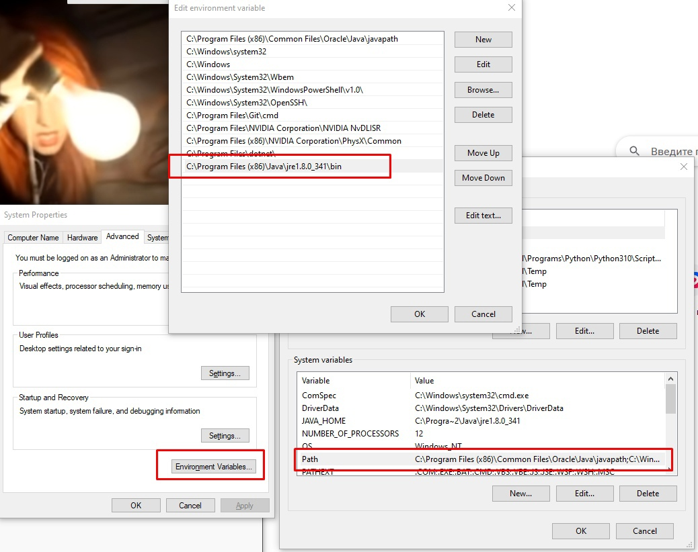
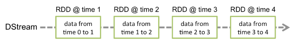
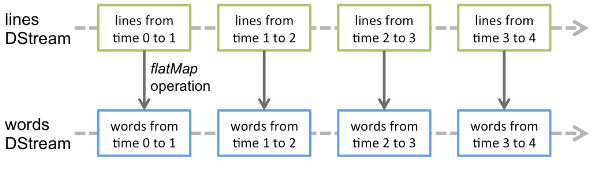

## Pyspark установка
1. Установи Python >= 3.7 
2. Установи pyspark using pip: ````pip install pyspark````
3. Установи Java
4. Установи переменные среды для Java как на картинках ниже


<br><br><br><br><br>

# Core
>Spark Core является основой всего проекта. Он обеспечивает распределенное выполнение задач, планирование и основные функции ввода-вывода. Spark использует специализированную фундаментальную структуру данных, известную как RDD (Resilient Distributed Datasets), которая представляет собой логическую коллекцию данных, разделенных между машинами. RDD могут быть созданы двумя способами: первый - путем ссылки на наборы данных во внешних системах хранения и второй - путем применения actions (например, map, filter, reducer, join) к существующим RDD.

Нужен для:
* Управления памятью
* Восстановления после сбоев
* Планирования, распределения и мониторинга заданий в кластере
* Взаимодействия с системой хранения

## RDD (Resilient Distributed Dataset)
> В Spark Core встроены RDD, неизменяемые отказоустойчивые, распределенные коллекции объектов, с которыми можно работать параллельно.
> <br>Работая с RDD, необходимо знать две основные вещи: : transformations и actions.
* RDD transformations возвращают указатель на новый RDD и позволяют создавать зависимости между RDD. Каждый RDD в цепочке зависимостей (String of Dependencies) имеет функцию для вычисления своих данных и имеет указатель (зависимость) на свой родительский RDD. Spark ленив, поэтому ничего не будет выполняться, пока вы не вызовете какое-либо преобразование или действие, которое вызовет создание и выполнение задания. Посмотрите на следующий фрагмент примера подсчета слов. Таким образом, преобразование RDD - это не набор данных, а шаг в программе, указывающий Spark, как получить данные и что с ними делать.
* RDD actions это операции (reduce, count...), которые возвращают значение в соответствии с инструкцией. 

## Пример (Создание RDD)
``` python
from pyspark import SparkContext, SparkConf

conf = SparkConf().setAppName(appName).setMaster(master)
sc = SparkContext(conf=conf)

# Parallelized collection
data = [1, 2, 3, 4, 5]
distDataRDD = sc.parallelize(data) # После создания распределенного набора данных (distDataRDD) с ним можно работать параллельно.
print(distDataRDD.reduce(lambda a, b: a + b))

# Внешний набор данных
distFileRDD = sc.textFile("data.txt")
distFileRDD2 = distFileRDD.map(lambda s: len(s))
print(distFileRDD2.reduce(lambda a, b: a + b))
```
# Spark SQL
> Spark SQL - это модуль Spark для обработки структурированных данных. Spark SQL позволяет запрашивать структурированные данные внутри программ Spark, используя либо SQL, либо привычный API DataFrame. Используется в Java, Scala, Python и R.
## Возможности
* Чтение и запись данных в различных структурированных форматах (например, JSON, таблицы Hive, Parquet, Avro, ORC, CSV).
* Позволяет запрашивать данные с помощью коннекторов JDBC/ODBC из внешних источников данных бизнес-аналитики (BI), таких как Tableau, Power BI, Talend, или из РСУБД, таких как MySQL и PostgreSQL.
* Предоставляет программный интерфейс для взаимодействия со структурированными данными, хранящимися в виде таблиц или представлений в базе данных, из приложения Spark.
* Предлагает интерактивную оболочку для выполнения SQL-запросов к структурированным данным.

## Примеры
### Базовая конфигурация
``` python
from pyspark.sql import SparkSession

# SparkSession - это точка входа для работы со Spark
spark = SparkSession \
    .builder \
    .appName("Python Spark SQL basic example") \
    .config("spark.some.config.option", "some-value") \
    .getOrCreate()

# Creating view from an existing data collection
my_table = csv_data.createOrReplaceTempView('my_table')
```
### Обработка данных 
``` python
# Обработаем набор данных, содержащий информацию о твитах, id которых находится в диапазоне от 1 до 10:
csv_data = spark.read.option('header','True').csv('my_tweets.csv',sep=',')
my_table = csv_data.createOrReplaceTempView('tweets_table')
sql_table = spark.sql('SELECT  Tweet FROM tweets_table WHERE id IN (1,10)')sql_table.show()
```


# Spark Streaming
## Обзор
> Spark Streaming - это расширение основного API Spark, которое позволяет выполнять масштабируемую, высокопроизводительную и отказоустойчивую обработку потоков данных в реальном времени. Данные могут поступать из различных источников, таких как Kafka, Kinesis или TCP-сокеты, и могут обрабатываться с помощью сложных алгоритмов, выраженных с помощью высокоуровневых функций, таких как map, reduce, join и window. Наконец, обработанные данные могут быть переданы в файловые системы, базы данных и живые приборные панели. Фактически, вы можете применять алгоритмы машинного обучения и обработки графов Spark к потокам данных.


## Discretized Streams (DStreams)
> Discretized Streams или DStream - это базовая абстракция, предоставляемая Spark Streaming. Он представляет собой непрерывный поток данных, либо входной поток данных, полученный из источника, либо обработанный поток данных, созданный путем преобразования входного потока. Внутри DStream представлен непрерывной серией RDD, которая является абстракцией Spark для неизменяемого, распределенного набора данных (подробнее см. руководство по программированию Spark). Каждый RDD в DStream содержит данные за определенный интервал времени, как показано на следующем рисунке.



> Любая операция, применяемая к потоку DStream, переводится в операции над лежащими в его основе RDD. Например, в предыдущем примере преобразования потока строк в слова операция flatMap применяется к каждому RDD в потоке строк DStream для создания RDD потока слов DStream. Это показано на следующем рисунке.  



## Пример
``` python
from pyspark import SparkContext
from pyspark.streaming import StreamingContext

# Создайте локальный StreamingContext с двумя рабочими потоками и интервалом пакетной обработки 1 секунда
sc = SparkContext("local[2]", "NetworkWordCount")
ssc = StreamingContext(sc, 1)

# Создайте DStream, который будет подключаться к имени хоста:порту, например, localhost:9999
lines = ssc.socketTextStream("localhost", 9999)

# Разделите каждую строку на слова
words = lines.flatMap(lambda line: line.split(" "))

# Подсчитайте каждое слово в каждой партии
pairs = words.map(lambda word: (word, 1))
wordCounts = pairs.reduceByKey(lambda x, y: x + y)

# Выведите на консоль первые десять элементов каждого RDD, сгенерированного в этом DStream
wordCounts.pprint()


ssc.start()             # Начать вычисления
ssc.awaitTermination()  # Ожидание окончания вычислений
```
# Spark MLlib
> Spark MLlib - это библиотека фреймворка Apache Spark, которая позволяет реализовать механизм машинного обучения (ML) и решать задачи, связанные с построением и обучением ML-моделей (например, модель классификации, модель регрессии, модель кластеризации). Spark MLlib позволяет работать с машинным обучением в распределенном кластере, то есть обучение модели может выполняться несколькими узлами (компьютерами) одновременно. При этом в качестве обучающих данных он принимает распределенные наборы RDD (Resilient Distributed Dataset).
## Алгоритмы
* Classification: logistic regression, naive Bayes,...
* Regression: generalized linear regression, survival regression,...
* Decision trees, random forests, and gradient-boosted trees
* Recommendation: alternating least squares (ALS)
* Clustering: K-means, Gaussian mixtures (GMMs),...
* Topic modeling: latent Dirichlet allocation (LDA)
* Frequent itemsets, association rules, and sequential pattern mining
# Spark GraphX
## Обзор
> GraphX - это новый компонент Spark для графов и графо-параллельных вычислений. На высоком уровне GraphX расширяет Spark RDD, представляя новую абстракцию графа: направленный мультиграф со свойствами, привязанными к каждой вершине и ребру. GraphX включает набор графовых алгоритмов для упрощения аналитических задач.
## Property graph
> Property graph представляет собой направленный мультиграф с определенными пользователем объектами, прикрепленными к каждой вершине и ребру. Как и RDD, графы свойств являются неизменяемыми, распределенными и отказоустойчивыми. Изменения значений или структуры графа выполняются путем создания нового графа с желаемыми изменениями. Как и в случае с RDD, каждый раздел графа может быть воссоздан на другой машине в случае сбоя.
## Операции над графами
> Подобно тому, как RDD имеют базовые операции, такие как map, filter и reduceByKey, графы свойств также имеют набор базовых операторов, которые принимают определенные пользователем функции и создают новые графы с преобразованными свойствами и структурой.
## Пример (Creating property graph)
``` scala
// Assume the SparkContext has already been constructed
val sc: SparkContext
// Create an RDD for the vertices
val users: RDD[(VertexId, (String, String))] =
  sc.parallelize(Seq((3L, ("rxin", "student")), (7L, ("jgonzal", "postdoc")),
                       (5L, ("franklin", "prof")), (2L, ("istoica", "prof"))))
// Create an RDD for edges
val relationships: RDD[Edge[String]] =
  sc.parallelize(Seq(Edge(3L, 7L, "collab"),    Edge(5L, 3L, "advisor"),
                       Edge(2L, 5L, "colleague"), Edge(5L, 7L, "pi")))
// Define a default user in case there are relationship with missing user
val defaultUser = ("John Doe", "Missing")
// Build the initial Graph
val graph = Graph(users, relationships, defaultUser)
```
